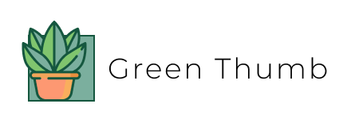

# Green Thumb 🌱
<p align="center"></p>
<p align="center">&laquo;<b>Green Thumb is an app built to help you find a new green friend</b>&raquo;</p>

This project was part of the Red Ventures frontend test. The challenge consists in building an application that consumes an API by filtering some plant preferences, like the amount of sunlight and watering the plant needs and if it is toxic or not for animals. When the result is filtered, the application offers a form for buying the chosen green friend. It validates user name and email, then sends it to the backend API.

There wasn't tooling limitations, so it was built with React, following functional componentization approach, and Styled-Components was used for styling.

You can access the live application on the following link: http://greenthumb.netlify.app/

### Layout

The layout was designed by Red Ventures and provided for the development. The provided Sketch file was used on Figma for checking spacing, size, fonts and colors specifications. Some icons and illustrations were exported from Figma as well.

### Installing

To run the project on development mode, you just need an LTS Node version installed (v12 recommended), and Yarn for managing the packages. If you haven't it yet, you can follow [Yarn installation guide](https://classic.yarnpkg.com/pt-BR/docs/install/), on their official page.

With Node and Yarn installed, run the commands below. They will clone the project on current folder, download all the project dependencies and, in a few minutes, the project will open on your default browser, on the port `:3000`.

```shell
git clone https://github.com/bolognini/green-thumb.git
cd green-thumb
yarn && yarn start
```

## Running the tests

To run all the unit tests and checking their coverage, please run the commands below

```shell
yarn test:coverage
```

Coverage report folder will be automatically created on root folder of the project. Access it running the command below. It should open the HTML file that contains all detailed coverage report

```shell
cd coverage/lcov-report && open index.html
```

## Built With

* [create-react-app](https://github.com/facebook/create-react-app) - Most popular React boilerplate
* [Styled Components](https://styled-components.com/) - CSS in JS library
* [Jest](https://jestjs.io/) - Testing framework
* [Husky](https://github.com/typicode/husky) - Git Hooks lib
* [ESLint](https://eslint.org/) - JavaScript Linter
* [Stylelint](http://stylelint.io/) - CSS Linter
* [Netlify](https://www.netlify.com/) - For CI/CD and deployment
* [Flaticon](https://www.flaticon.com/br/icone-gratis/plantar_628324?term=plant&page=2&position=36) - For README icon